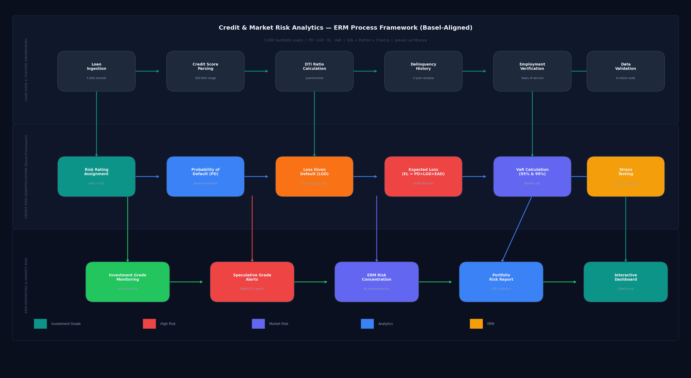

# Credit & Market Risk Analytics Dashboard
### Risk Analytics Portfolio | Jeevan Lal Mourya


### [▶ View Live Dashboard](https://jm5333.github.io/credit-market-risk-dashboard/credit_dashboard.html)

> Built a Basel II/III-aligned credit risk model analyzing 5,000 synthetic loans using Probability of Default (PD), Loss Given Default (LGD), and Expected Loss (EL) calculations. Includes Value at Risk (VaR) stress testing and portfolio concentration analysis — structured to mirror the type of reporting a bank risk team would produce for senior management.

---

## Process Flow



---

## Dashboard Preview


---

## Key Findings

| Metric | Result | Context |
|---|---|---|
| Portfolio Default Rate | 7.28% | Slightly above the 5% watch threshold — driven by BBB and BB tier |
| Total Expected Loss | $21.4M (3.28% of portfolio) | Within acceptable range; BBB segment drives 42% of total EL |
| Stress Scenario Loss Estimate (99th Pct) | $97.6M | Stress scenario: 1-in-100 loss estimate across the portfolio |
| Avg Credit Score | 708 | Near-prime portfolio; most loans fall in A–BBB tier |
| Avg Debt-to-Income | 1.56x | Conservative — well below 2.5x underwriting threshold |
| Highest Risk Segment | B/CCC (19–22% default rate) | Small share of portfolio but disproportionate risk |

---

## Business Recommendations

These are the practical actions the data points to:

1. **BBB tier is the main risk driver** — 1,556 loans, 9.4% default rate, and $8.89M in expected loss. That's 42% of total EL from one rating bucket. Tightening BBB underwriting criteria (e.g. requiring credit score ≥ 700 + DTI < 2.0x) would meaningfully reduce portfolio EL.

2. **B and CCC loans should be flagged for review** — 347 loans with 19–22% default rates represent outsized risk relative to their portfolio share. Recommend credit enhancement requirements or position limits for these tiers.

3. **Business loans have the lowest default rate (5.1%)** — compared to personal loans at 8.3%. If the goal is reducing portfolio default rate, shifting origination mix toward business lending would help.

4. **BB/B/CCC concentration is at 17.4%** — within typical bank limits of 15–20%, but worth monitoring. If it crosses 20%, speculative-grade concentration becomes a regulatory discussion.

5. **VaR 99% at $97.6M is 15% of portfolio** — reasonable for a stress scenario, but the A and BBB tiers drive the bulk of it ($63.9M combined) simply due to their size. Risk-adjusted capital should account for this concentration.

---

## Python — How It Was Built

```python
import pandas as pd
import numpy as np

# Basel II Expected Loss
LGD = 0.45  # Loss Given Default — Basel II unsecured standard

df['expected_loss'] = (
    df['probability_of_default'] * LGD * df['loan_amount']
)

# Value at Risk — Market Risk Component
df['var_95'] = df['loan_amount'] * 0.08   # 1.65σ — 95% confidence
df['var_99'] = df['loan_amount'] * 0.15   # 2.33σ — 99% confidence

# Portfolio summary
portfolio = df.agg({
    'loan_amount':    'sum',
    'expected_loss':  'sum',
    'var_99':         'sum',
    'defaulted':      'mean'
})

el_pct = portfolio['expected_loss'] / portfolio['loan_amount'] * 100
print(f"Default Rate: {portfolio['defaulted']*100:.2f}%")
print(f"Expected Loss: ${portfolio['expected_loss']/1e6:.1f}M ({el_pct:.2f}% of portfolio)")
print(f"VaR 99%: ${portfolio['var_99']/1e6:.1f}M")

# Risk concentration by rating
concentration = df.groupby('risk_rating').agg(
    count=('loan_id', 'count'),
    exposure=('loan_amount', 'sum'),
    expected_loss=('expected_loss', 'sum'),
    default_rate=('defaulted', 'mean'),
    var_99=('var_99', 'sum')
).sort_values('expected_loss', ascending=False)
```

---

## Risk Quantification Methodology

**Expected Loss (EL)**
```
EL = PD × LGD × EAD

PD  = Model-derived probability of default (borrower-level)
LGD = 45% — Basel II standard for unsecured consumer lending
EAD = Full loan balance (fully drawn assumption)
```

**Probability of Default Model**
```
Base PD = 2% (prime borrower baseline)

Adjustments:
  Credit score < 580          → +18%  (subprime)
  Credit score 580–619        → +10%  (near-subprime)
  Debt-to-Income > 3.0x      → +6%
  Debt-to-Income 2.5–3.0x    → +3%
  Delinquencies > 1 (2yr)    → +8%
  Employment < 1 year         → +4%
```

**Value at Risk**
```
VaR 95% = Loan Amount × 8%   (1.65 standard deviations)
VaR 99% = Loan Amount × 15%  (2.33 standard deviations)
```

### Why These Assumptions?

| Assumption | Value | Why |
|---|---|---|
| LGD | 45% | Basel II standardized floor for unsecured consumer loans |
| VaR 95% multiplier | 8% | 1.65σ — standard normal distribution assumption |
| VaR 99% multiplier | 15% | 2.33σ — tail risk, commonly used in stress testing |
| Base PD | 2% | Reflects prime borrower historical default rates |
| Subprime threshold | Credit score < 580 | FICO standard subprime classification |

---

## SQL Queries

| Query | What It Shows |
|---|---|
| `1_portfolio_kpi_summary` | Top-line risk metrics — default rate, EL, VaR |
| `2_credit_risk_by_rating` | Rating-by-rating breakdown of PD, EL, VaR |
| `3_pd_segmentation` | Default probability buckets across the portfolio |
| `4_var_market_risk` | VaR 95%/99% by rating tier |
| `5_high_risk_identification` | Flags B/CCC loans for individual review |
| `6_erm_risk_concentration` | EL and exposure by loan purpose |

---

## Repository Structure

```
credit-market-risk-dashboard/
├── data/
│   └── credit_risk.csv             # 5,000 synthetic loan records
├── sql/
│   └── credit_queries.sql          # 6 SQL queries
├── dashboard/
│   └── credit_dashboard.html       # Interactive dashboard
├── credit_process_map.png          # Process flow diagram
├── screenshot_credit.png           # Dashboard preview
└── README.md
```

---

*Fully synthetic dataset — no real customer or loan data used.*
*April 2026 | Risk Analytics Portfolio — Jeevan Lal Mourya | github.com/jm5333*
